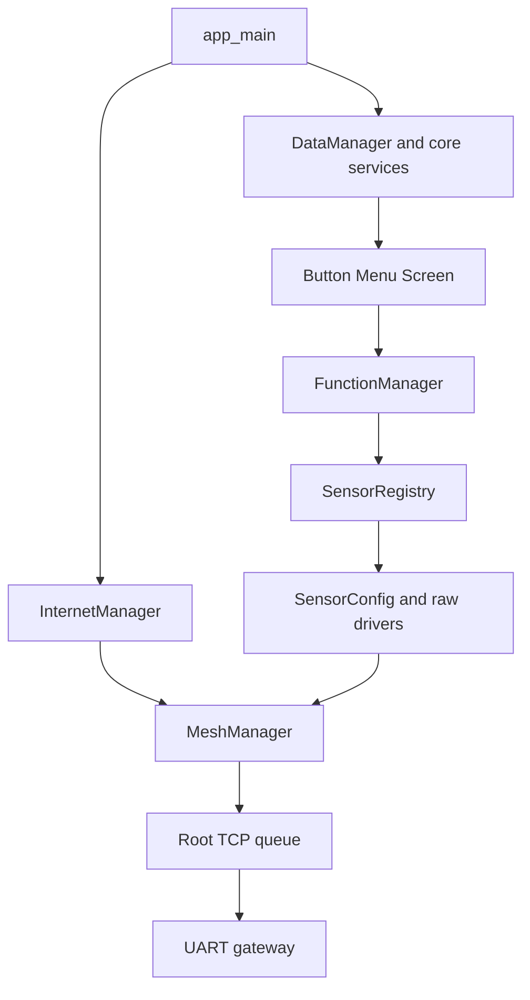

# Firmware architecture overview

This ESP-IDF firmware turns each configured **ESP32** device into either a Mesh-Lite node that samples local environmental sensors or a root that aggregates node telemetry and forwards it to an external UART gateway. `app_main` defaults to mesh node mode. The product boundary is local acquisition → newline-delimited JSON over TCP inside the mesh → root-only UART forwarding; WebSocket and captive portal are configuration facilities, not this telemetry path.

This diagram shows the production ownership route, not all compile-time dependencies.

## Layer boundaries

| Layer | Owns | Must not own |
|---|---|---|
| `main` | composition and boot ordering | transport implementation |
| core/DataManager | application-facing state, selected ports, display status, error history | mesh sockets, transport queue, parser |
| sensors | driver ABI, registry and adapters | UI navigation or TCP |
| drivers | hardware transactions/protocol details | product role policy |
| UI | button interpretation, menu tree, display synchronization | direct transport/socket operations |
| network/InternetManager | exclusive Wi-Fi/mesh lifecycle | raw telemetry socket manipulation |
| MeshManager | Mesh-Lite setup coordination, private gateway queue, TCP transport lifecycle/public API | DataManager transport fields |
| UartToGateWay | UART driver/tasks and public MeshManager queue consumption | direct queue ownership |

The principal patterns are a static driver registry, callback-driven menus, a shared application model, singleton-like managers, and **single-owner concurrency** for sockets. See [Boot lifecycle](lifecycle-and-tasks.md), [Mesh TCP](../network/mesh-tcp.md), and [Application state](../core/application-state-and-services.md).