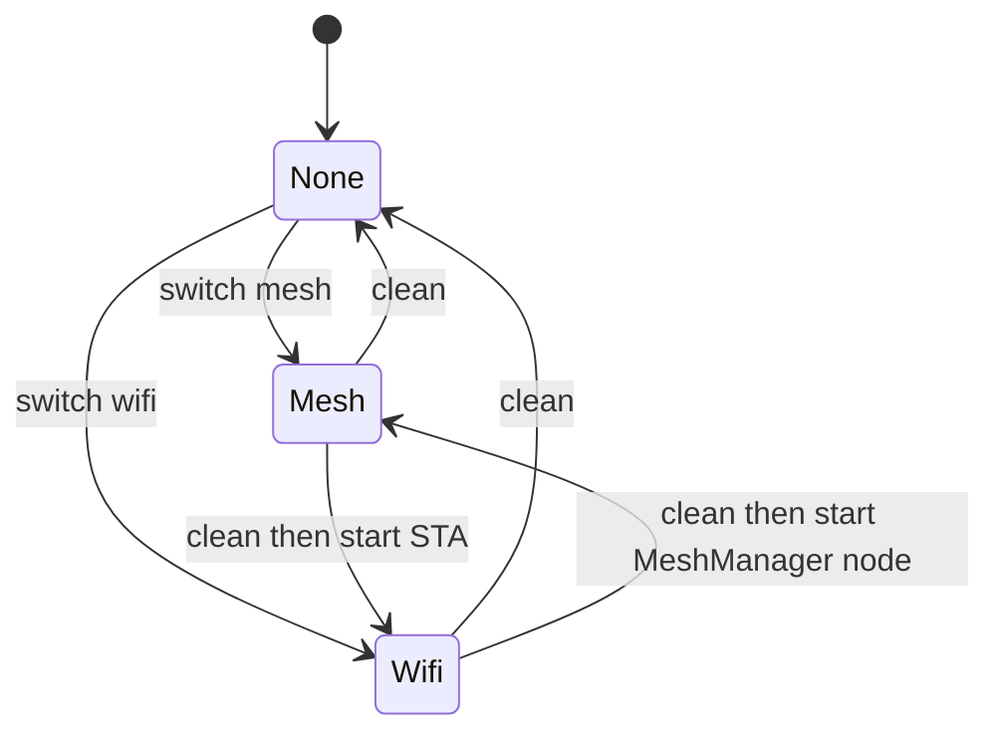

# Internet modes and Wi-Fi

`InternetManager` owns the high-level exclusivity rule: `INTERNET_MODE_NONE`, `INTERNET_MODE_WIFI`, and `INTERNET_MODE_MESH` are mutually transitioned under `s_transitioning`. A concurrent request is rejected with `MRS_ERR_CORE_INVALID_STATE`.

For every change, `InternetManager_CleanCore(data, true)` executes this order: stop tracked `TASK_WIFI_CONFIG` and `TASK_WIFI_MESH_JOIN`; request WiFi manager task shutdown; stop MeshManager (which waits up to 6000 ms for its transport task); stop/disconnect ESP Wi-Fi; remove bridge netifs and destroy default STA/AP netifs if requested; then `esp_wifi_restore`; finally set mode none. Mesh start invokes this cleanup, then `MeshManager_StartMesh(data, MESH_ROLE_NODE)` and sets mesh mode. Wi-Fi start invokes cleanup then `wifi_init_sta()` and sets Wi-Fi mode. This order matters because transport sockets must be closed before network interfaces are destroyed.

**Current startup mismatch:** `MeshManager_StartMesh` returns `void`; it can fail queue creation, Mesh-Lite start, or TCP-task creation internally, yet `InternetManager_StartMesh` unconditionally sets MESH and `MRS_OK`. `MeshManager_IsStarted()` is currently the real readiness observation. A safe future contract is an `esp_err_t` mesh start: on any staged failure undo only created queue/network/task resources, leave `started=false` and `meshIo.link_up=false`, retain mode NONE, set `s_last_error`, and append a single error. Only that success may enable role UI or UART `Start Root` behavior.

`wifi_manager_stop_tasks` signals `wifi_connect`/`wifi_mgr`, stops HTTP/DNS, waits for handles to clear, and clears Wi-Fi manager netif pointers; InternetManager destroys netifs afterward. `wifi_init_common` creates default STA/AP netifs whereas mesh creates bridge netifs, so this wait-before-destroy ordering is the re-entry contract for Wi-Fi → mesh → Wi-Fi. If worker or mesh transport shutdown times out, do not destroy resources a live task can still touch; report failure rather than claiming a completed transition.

## Wi-Fi mode

`wifi_init_sta` creates its event group/mutex, initializes netif/event loop/default STA+AP and ESP Wi-Fi in RAM storage, loads stored HTTP configuration, and tries configured startup credentials. If none connect, it starts APSTA captive mode. It then starts `wifi_connect` and `wifi_mgr`, each stack 4096 and priority 5. ESP events set link/IP bits and update attached `dm_wifi_t` state.

The AP is open (`authmode=WIFI_AUTH_OPEN`), starts DHCP and a DNS server on port 53, serves `/spiffs/index.html`, and runs HTTP on port **80** regardless of stored HTTP port. Routes are:

| Route | Method | Behavior |
|---|---|---|
| `/` | GET | returns SPIFFS `index.html` |
| `/configure` | POST | accepts JSON Wi-Fi credentials, `ws_url`, `http_ip`, `http_port` |
| `/status` | GET | AP state, SSID, WebSocket URL, HTTP endpoint |
| `/scan` | GET | serializes Wi-Fi scan records |
| captive probe paths and 404 | GET/error | returns the root portal |

The custom DNS server answers queries with the AP address (and an IPv4-mapped answer for AAAA), steering captive clients to the portal. User-submitted SSID/password are stored in RAM pending/configured fields and trigger the reconnect task; this code does not persist those credentials in NVS. HTTP endpoint config is persisted under NVS namespace `http_cfg` keys `http_ip` and `http_port`. AP IP config uses `wifi_ap` keys `ap_ip`, `ap_netmask`, `ap_gateway`.

The provisioning interface has no authentication or authorization code: the AP is open and handlers accept JSON after size/string copying, without endpoint authentication. It should only be exposed in a trusted physical/network context. The repository also contains hard-coded boot Wi-Fi entries in `wifi_manager_core.c`; documentation intentionally does not reproduce secret values. Their existence is a source-proven configuration risk, covered in [Known limitations](../reference/known-limitations.md).

### Input contract and observed gaps

`/configure` calls `httpd_req_recv` once into 512 bytes. It parses SSID/password, WebSocket URL, and HTTP endpoint fields, but does not loop for an oversized/incomplete body; IP is copied/truncated rather than syntactically validated; a JSON number is cast to `uint16_t`; and NVS save failures are logged while the handler can still form a success-style response. Submitted Wi-Fi values are handed asynchronously to `wifi_connect_task`, not proof of connection. Stored `http_port` is status configuration only: portal `start_webserver` binds 80. A corrective implementation should reject truncated body, invalid JSON/type/range/IP, and failed NVS commits with one explicit error response; validate before mutating pending state; and either apply the persisted HTTP port or rename it to avoid implying listener control. Do not log SSIDs/credentials in production. These changes do not add authentication—the source presently has none.

## WebSocket capability

`WSHandle` wraps the vendored WebSocket client with a mutex-protected singleton. `WSHandle_Init`, `Start`, `Stop`, `Deinit`, callback setters, text/binary sends, and connection status form the public surface. It stores URL in namespace `ws_handle`, key `url`, and accepts configured URI, headers, timeouts, ping interval and callbacks. The portal’s `ws_url` path calls `save_ws_url`.

No inspected application flow starts or sends through WSHandle automatically; it is provisionable infrastructure, not the mesh telemetry route. Telemetry is TCP to root then UART, as documented in [Mesh TCP](mesh-tcp.md).