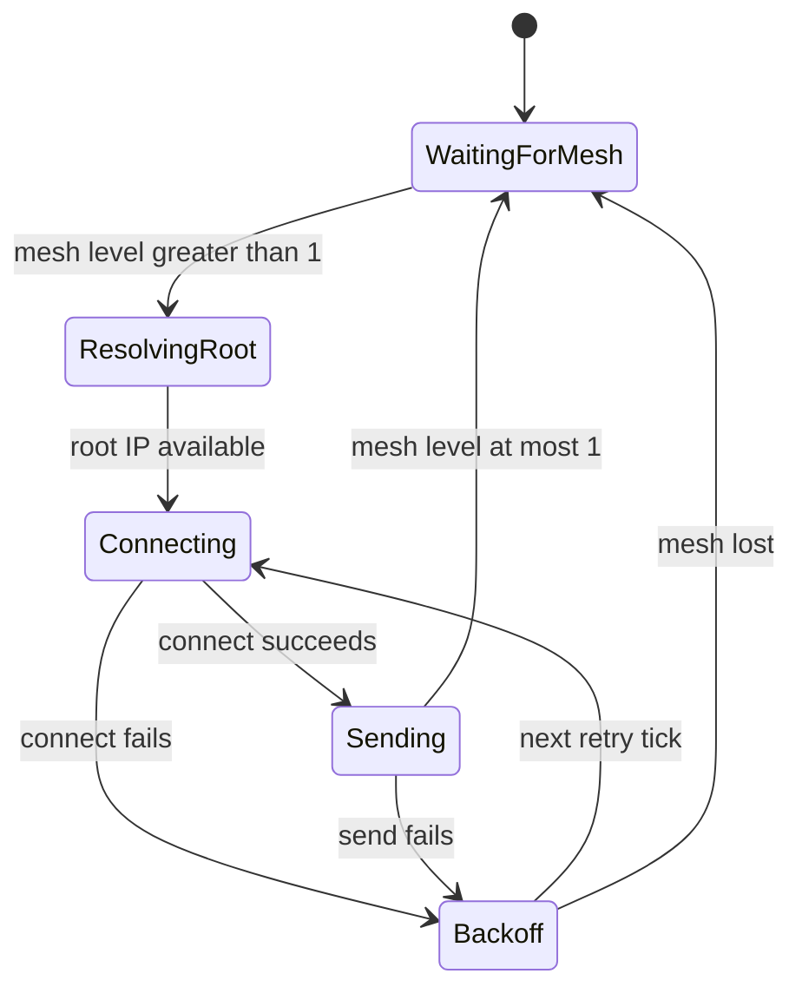
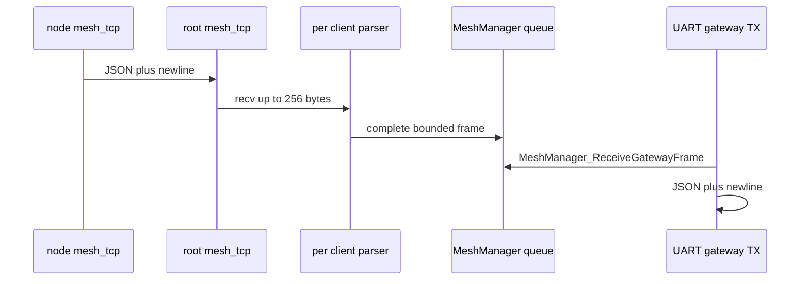

# Mesh TCP transport

`MeshManager.c` is the public lifecycle facade. It creates the private 32-frame `gateway_queue`, starts Mesh-Lite networking, starts exactly one `mesh_tcp` task, exposes role/status/statistics/receive APIs, and tears down in reverse-safe order. It does **not** parse TCP or let `DataManager` own sockets.

## Ownership invariant

| Resource | Owner | Consumer |
|---|---|---|
| mesh bridge, AP/STA, Mesh-Lite configuration | `mesh_network.c` | MeshManager |
| node socket, root listener, accepted sockets, parsers | `mesh_tcp_transport.c` / `mesh_tcp` task | no external direct consumer |
| gateway queue | MeshManager private context | UartToGateWay via `MeshManager_ReceiveGatewayFrame` |
| minimal role/link state | `DataManager.meshIo` | UI and public status |

One task closes every TCP descriptor. On desired-role change it detects the difference, closes node/listener/all clients, resets reconnect state, then enters the new role. On stop it receives an event bit, closes all sockets itself, clears link state, signals STOPPED, and deletes itself. This prevents two contexts from closing a reused descriptor or mutating an `fd_set` concurrently.

## Node lifecycle

`run_node` only transmits when `esp_mesh_lite_get_level() > 1`; otherwise it closes an existing node socket and polls every 200 ms. Root address resolution prefers `esp_mesh_lite_get_root_ip`, then the `WIFI_STA_DEF` gateway, then `CONFIG_MESH_ROOT_FALLBACK_IP`. The socket is bound to the station interface when available, uses nonblocking connect plus `select()` for `CONFIG_MESH_TCP_CONNECT_TIMEOUT_MS`, then reverts flags and enables keepalive.

At `CONFIG_MESH_TCP_SEND_INTERVAL_MS` (current sdkconfig: 1000 ms), it calls `mesh_telemetry_build`, sends all JSON bytes, then sends `\n`. A failure closes the socket and schedules retry at 1000 ms plus random 0–249 ms jitter; the delay doubles to a 10000 ms cap. A new successful connection resets the base backoff and forces immediate next send. This re-resolves root IP at each reconnect, accommodating root IP changes.

## Root lifecycle and multi-client rationale

A TCP server needs **one listening socket** to accept new connections and **one accepted socket per concurrent node** to exchange data after acceptance. The root opens `AF_INET/SOCK_STREAM`, `SO_REUSEADDR`, binds `INADDR_ANY:CONFIG_MESH_TCP_PORT`, and calls `listen(..., CONFIG_MESH_TCP_MAX_CLIENTS)`.

A single 200 ms `select()` loop puts the listener and all active clients into one read set. Listener readiness causes one `accept`; client readiness causes `recv` and parser feeding. There is no task-per-client model. This bounds stack/task consumption on ESP32 and centralizes socket ownership. Current limits are `CONFIG_MESH_TCP_MAX_CLIENTS=5` and `CONFIG_LWIP_MAX_SOCKETS=10`; the root needs at least **five accepted sockets plus one listener**, while other networking sockets also consume the LwIP total. A client is rejected and closed if no slot exists or its descriptor exceeds `FD_SETSIZE`.

Each accepted slot retains peer IP, MAC text, last sequence, and its **own** parser. When a complete frame exposes a MAC, `deduplicate_client` closes any other active slot with the same MAC. MAC, rather than peer IP, identifies a node because DHCP/reconnect can change IP.

**What acceptance means today:** `mesh_telemetry_extract_origin` only uses `strstr`/numeric conversion to extract `M`, `seq`, and `n`; it does not parse or validate JSON, MAC format, schema version, required fields, or numeric ranges. `last_sequence` is recorded but no replay/duplicate frame is rejected. Thus newline termination and frame size are the current admission boundary, not protocol validity. A hardening change should parse bounded JSON before enqueue, require compatible `v`, a canonical MAC, `seq`, `n`, `t`, `ver`, `err`, and `p`, reject malformed/out-of-range input, and explicitly define replay behavior per MAC. Preserve the queue boundary: only a copied `mesh_gateway_frame_t` enters the private root queue, and only root role can dequeue it.

## Stream framing and overload behavior

TCP is a byte stream: a single `recv` can be a fragment of JSON or contain multiple frames. `mesh_stream_parser_push` accumulates bytes until LF. It removes an immediately preceding CR, so both LF and CRLF are accepted. Empty lines are ignored. Frames are never based on `recv` boundaries.

`MESH_TELEMETRY_FRAME_SIZE` is 512. Once a parser buffer is full, it clears buffered bytes, enters `discarding_oversized_frame`, and ignores input until the next LF; the transport increments dropped frames when it sees that condition. A complete frame is copied into `mesh_gateway_frame_t` only if 1–512 bytes and pushed with zero wait. A full queue does not block socket processing: it drops the frame and increments `dropped_frames`.

## Root-to-gateway path

`uart_gateway_tx_task` runs at priority 7 and only forwards in mesh mode while the public role is root. It waits 100 ms for a frame, emits `No node\n` at most once per `MESH_ROOT_UART_NO_NODE_MS` (1000 ms) on an empty queue, and after one received frame drains up to 64 more without blocking. It forwards raw queue JSON unchanged except for adding newline; `ProcessingDataMesh_ProcessFrame` is included in the source but not called by this forwarding path.

The reciprocal RX task recognizes case-insensitive CR/LF commands: `Start Root` requests root role if mesh is ready and responds `Switching to root mode...\r\n`; `Connected` refreshes a gateway heartbeat. After root activation, no heartbeat for over one second triggers a node-role callback. RX FIFO/buffer overflow flushes input and resets the UART event queue. See [Contracts](../contracts/telemetry-and-apis.md) for payload and public API details.

### Requested versus active role

`MeshManager_SwitchRole` updates `DataManager.meshIo.role` and transport `desired_role` immediately, but the `mesh_tcp` task applies it later on its poll loop as `active_role` after socket closure. Actual connectivity is independently `esp_mesh_lite_get_level() > 0`; node traffic further requires level > 1. Consequently root UI and UART TX currently gate on requested public role and can observe root before bind/listen succeeds. A readiness API should distinguish requested role, transport-active role, listener-ready state, and mesh link. On root bind failure the task retries after 1 s; role transition closes active clients and leaves queued frames intact, so callers must decide whether to drain, tag, or clear stale queue data. This avoids routing through a role that has only been requested, not activated.